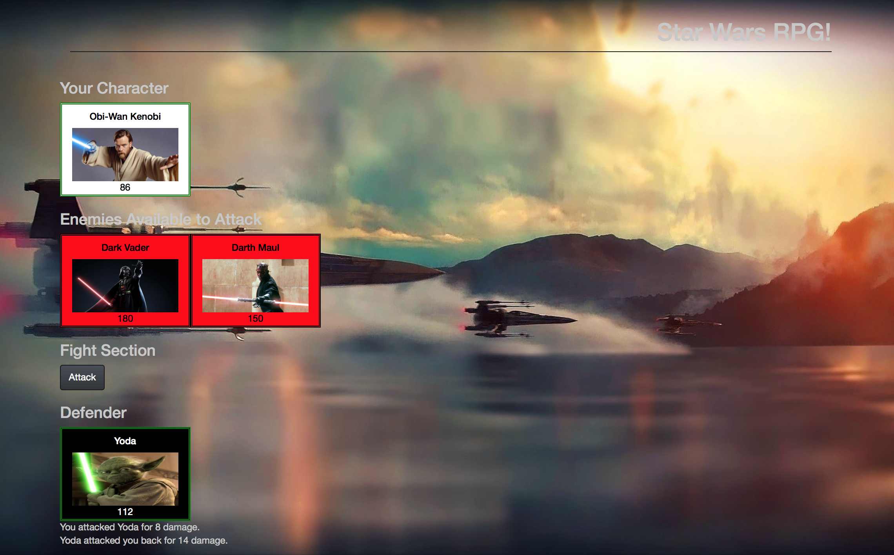

# Star Wars RPG!

### Overview
An awesome RPG game on the web for Star Wars Fan!

### How the app works -

When the game starts, the player will choose a character by clicking on the fighter's picture. The player will fight as that character for the rest of the game.

The player must then defeat all of the remaining fighters. 
Once the player selects an opponent, that enemy is moved to a defender area.

The player will now be able to click the attack button.

Whenever the player clicks attack, their character damages the defender. The opponent will lose HP (health points). 
The opponent character will instantly counter the attack. When that happens, the player's character will lose some of their HP.

The player wins the game by defeating all enemy characters. The player loses the game the game if their character's HP falls to zero or below.

#### Gameplay logic -
Each character in the game has 3 attributes: Health Points, Attack Power and Counter Attack Power.

Each time the player attacks, their character's Attack Power increases by its base Attack Power.

For example, if the base Attack Power is 6, each attack will increase the Attack Power by 6 (12, 18, 24, 30 and so on).
The enemy character only has Counter Attack Power.

Unlike the player's Attack Points, Counter Attack Power never changes.

#### Hint if you want them -
A winning player must pick their characters wisely by first fighting an enemy with low Counter Attack Power. This will allow them to grind Attack Power and to take on enemies before they lose all of their Health Points. 
Your players should be able to win and lose the game no matter what character they choose. The challenge should come from picking the right enemies, not choosing the strongest player.

#### Enjoy and may the force be with you!

